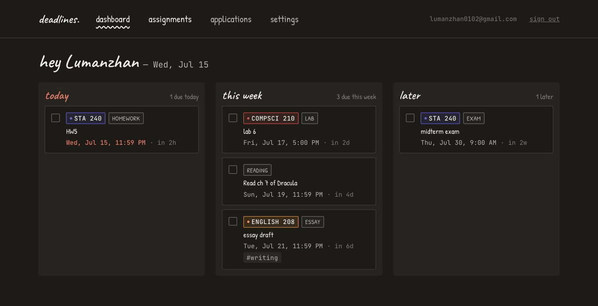
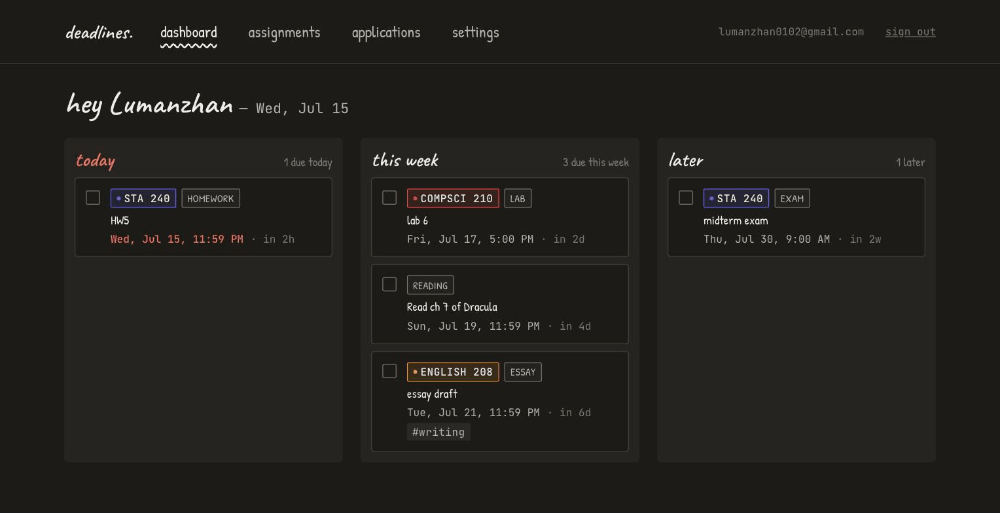
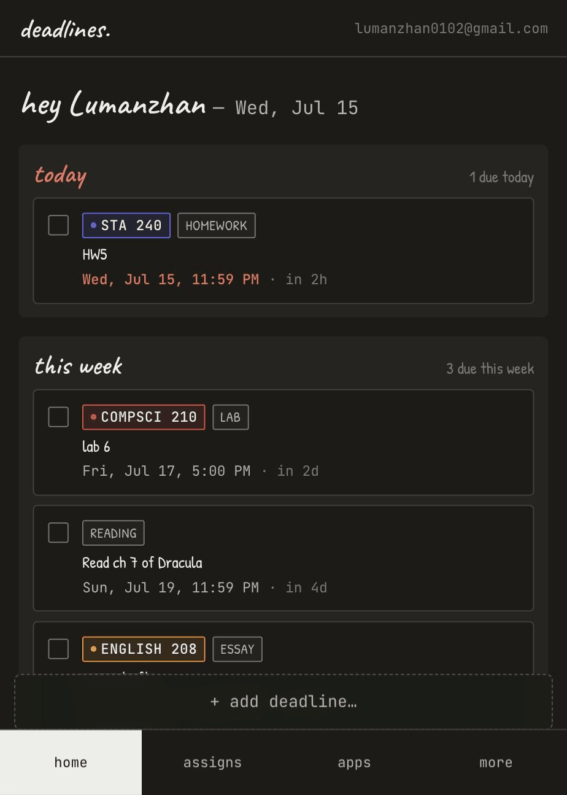
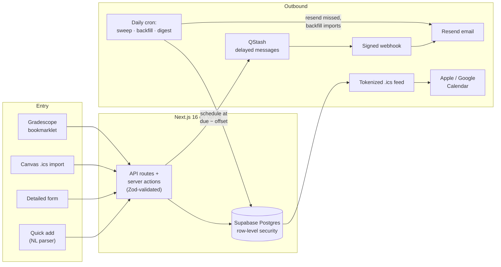

<div align="center">
  

# Deadline Tracker

**Natural-language deadline tracking that follows you everywhere** — type
`STA 240 HW5 due Friday 11:59pm` and it becomes a parsed assignment with
scheduled email reminders, an Apple Calendar event, and a spot on your
dashboard. A full-stack Next.js + Supabase app, deployed on Vercel as an
installable PWA, that I built and use every day.

[](https://nextjs.org/)
&nbsp;[](https://react.dev/)
&nbsp;[](https://www.typescriptlang.org/)
&nbsp;[](https://supabase.com/)
&nbsp;[](.github/workflows/ci.yml)
&nbsp;[](https://github.com/evelindsayyy/ddl_reminder/actions/workflows/ci.yml)

</div>

<div align="center">
  
  <p><sub>One typed line — course, type, due date, tag, and weekly recurrence parsed live, before saving.</sub></p>
</div>

## Why this exists

Coursework deadlines live in five places — Canvas, Gradescope, syllabi, email,
and my own head. This app makes one canonical list and then **pushes it back
out** to where I'll actually see it: email reminders at 1 week / 2 days / 12
hours before each deadline, a `webcal://` feed that Apple Calendar subscribes
to, and a phone-installable dashboard. Entry friction is near zero: one typed
line, parsed deterministically in milliseconds — no LLM round-trip, no forms
(though a labeled detailed form exists when you want it).

## Features

- **Natural-language quick add** — `chrono-node` + regex extract course code,
  type, title, due date, tags, and recurrence from one line. Deterministic,
  instant, self-scoring (low-confidence parses get a warning banner).
- **Recurring assignments** — `every Tuesday 11:59pm until May 1` expands into
  DST-safe rows through semester end; weekly, biweekly, and multi-day patterns
  (`every MWF`), with series-wide edit and delete.
- **Email reminders that don't silently die** — per-deadline scheduling via
  QStash with a daily reconciliation cron that re-sends anything dropped and
  backfills imported assignments (see [Architecture](#architecture)).
- **Calendar out** — per-user tokenized `.ics` feed; subscribe once in Apple or
  Google Calendar and every deadline appears next to the rest of your week.
- **Canvas import** — paste your Canvas calendar feed URL; a daily sync (plus a
  manual *sync now*) upserts assignments without clobbering your edits.
- **Gradescope sync** — no public API and SSO-gated, so a generated,
  token-authenticated bookmarklet scrapes your authenticated session client-side
  and POSTs to a rate-limited endpoint.
- **Application pipeline** — internship applications tracked separately with an
  8-stage lifecycle, kanban / timeline / funnel views, and next-action reminders
  riding the same infrastructure.
- **Three assignment views** — list grouped by course, month calendar, and a
  per-course Gantt-style timeline.
- **Dashboard** — overdue / today / this week / later buckets computed in your
  IANA timezone, optimistic mark-done, guided empty states.
- **Installable PWA** — responsive single-column collapse, bottom tab nav,
  sticky add bar, home-screen icon set.

<div align="center">
  
  
  <p><sub>The same dashboard on desktop and as an installed mobile PWA (bottom tabs, sticky add bar).</sub></p>
</div>

## Architecture



**Reminders are two-layered by design.** Layer 1 schedules a QStash message per
`(deadline, offset)` pair, delivered to a signature-verified webhook that sends
the email. Layer 2 is a daily cron that sweeps for scheduled reminders whose
fire time passed without delivery, backfills reminders for assignments created
by importers (which intentionally never schedule), and sends a morning digest.
Either layer alone can miss; together a deadline notification survives QStash
outages, importer edge cases, and webhook failures.

### Stack

| Layer         | Choice                                        | Why                                             |
|---------------|-----------------------------------------------|-------------------------------------------------|
| Framework     | Next.js 16 App Router + TypeScript (React 19) | One repo for UI and API, serverless on Vercel    |
| Database      | Supabase Postgres                             | Row-level security as the primary defense layer  |
| Auth          | Supabase Auth (email magic link)              | No passwords, no OAuth surface                   |
| Email         | Resend                                        | Reminder + digest delivery                       |
| Scheduling    | Upstash QStash + Vercel Cron                  | Per-reminder delays + daily reconciliation       |
| Parsing       | `chrono-node` + regex                         | Deterministic, instant, free — no LLM on keystroke |
| Time math     | `date-fns-tz` + `Intl`                        | Per-date zone offsets (DST-correct)              |
| Calendar      | `ical-generator`                              | Standards-compliant `.ics` feed                  |
| Styling       | Tailwind CSS                                  | Hand-drawn design system (see below)             |

## Engineering notes

Things in this codebase I'd point a reviewer at:

- **Timezone correctness as a discipline.** Everything is stored as UTC
  `timestamptz` and rendered in the user's IANA zone, but the hard part is
  *parsing*: zone offsets are recomputed **per target date** (never once per
  request), because an offset computed in April is wrong for a December
  deadline. Wall times from the detailed form go through an `Intl`-based
  round-trip that's pinned by tests for both DST boundaries — including the
  spring-forward gap, where a nonexistent 2:30am resolves forward instead of
  crashing.
- **Defense in depth.** Row-level security on every table (a route that forgets
  to filter still can't leak rows) · Zod validation on every mutating route ·
  QStash webhook signature verification · SSRF guard on user-supplied fetch
  URLs (HTTPS-only, private/loopback/metadata IPs blocked, redirects refused) ·
  256-bit rotatable tokens for the calendar feed and bookmarklet · DB-backed
  rate limiting on the sync endpoint · cron auth via bearer secret.
- **781 tests across a dual harness.** Pure logic (parser, recurrence, bucketing,
  scoring, schemas, time math — 721 assertions) runs as a dependency-free `tsx`
  chain; route handlers and components (60 tests) run under vitest + Testing
  Library with jsdom. CI runs typecheck, lint, and both suites on every push
  and PR.
- **Imports that respect your edits.** Canvas and Gradescope rows upsert on
  `(user_id, source, external_id)`, so re-syncing never duplicates and never
  overwrites your notes, time estimates, or completion state.
- **Polymorphic reminders with a CHECK constraint.** Assignments and
  applications share one `reminders` table (exactly one parent FK set),
  one scheduler, one webhook, one sweeper — chosen over a join table or STI
  and documented for reconsideration if a third parent type ever appears.
- **Optimistic UI done carefully.** Mark-done uses `useOptimistic` with a fade
  animation, per-item pending state, and server revalidation — failures roll
  back and toast.

## Design

The UI is deliberately hand-drawn — the personality of a paper planner with the
reliability of infrastructure:

- **Patrick Hand** for body text, **Caveat** for display headings, **JetBrains
  Mono** for dates, codes, and counts.
- All colors flow from Tailwind tokens ([design/DESIGN_TOKENS.md](design/DESIGN_TOKENS.md));
  the course palette in [lib/colors.ts](lib/colors.ts) is the only hex allowed in components.
- Light and dark themes (class-based, no-flash boot script, OS-following by default).
- Accessibility floor: 44px touch targets, labeled inputs, WAI-ARIA tab
  patterns with roving tabindex, `aria-current` wayfinding, rem-based type
  scale with a 13px minimum.

## Getting started

Requires Node ≥ 20 and a free-tier [Supabase](https://supabase.com) project.
Resend and QStash are optional — the app no-ops gracefully without them.

```bash
git clone git@github.com:evelindsayyy/ddl_reminder.git
cd ddl_reminder
npm install
cp .env.local.example .env.local   # fill in values (table below)
npm run dev                         # http://localhost:3000
```

| Variable | Where to get it | Required for |
|---|---|---|
| `NEXT_PUBLIC_SUPABASE_URL` / `NEXT_PUBLIC_SUPABASE_ANON_KEY` | Supabase → Project Settings → API | everything |
| `SUPABASE_SERVICE_ROLE_KEY` | Supabase → Project Settings → API | calendar feed, cron, webhooks |
| `NEXT_PUBLIC_APP_URL` | `http://localhost:3000` for dev | bookmarklet, feed, email links |
| `CRON_SECRET` | `openssl rand -hex 32` | cron auth |
| `RESEND_API_KEY` + `FROM_EMAIL` | [resend.com](https://resend.com) | reminder + digest email |
| `QSTASH_TOKEN` + `QSTASH_CURRENT_SIGNING_KEY` + `QSTASH_NEXT_SIGNING_KEY` | [console.upstash.com](https://console.upstash.com/qstash) | scheduled reminders |

Then:

1. **Migrations** — paste each file in [supabase/migrations](supabase/migrations)
   (`0001` → `0006`) into the Supabase SQL editor, in order.
2. **Auth** — Supabase → Authentication → URL Configuration: set Site URL to
   `http://localhost:3000` and add `http://localhost:3000/auth/callback` to
   redirect URLs. (Email provider is on by default.)
3. Sign in with your email — the magic link logs you in.

To deploy: import the repo on [Vercel](https://vercel.com), add the same env
vars, and [vercel.json](vercel.json) wires the daily cron automatically.

### Connecting integrations

- **Calendar feed:** Settings → integrations → copy the `webcal://` URL →
  Apple Calendar *File → New Calendar Subscription* (or Google Calendar
  *Other calendars → From URL*).
- **Canvas:** Canvas → Calendar → *Calendar Feed* → copy the URL → paste in
  Settings → *save* → *sync now*. The daily cron keeps it fresh.
- **Gradescope:** Settings → *generate bookmarklet* → drag **⤓ Sync to ddl**
  to the bookmarks bar → click it on any Gradescope assignments page.

## Development

```bash
npm run dev             # dev server
npm run typecheck       # tsc --noEmit
npm run lint            # eslint (flat config)
npm test                # tsx pure-logic chain (parser, recurrence, time math, …)
npm run test:unit       # vitest — routes + components (jsdom, RTL)
npm run test:all        # both — the local gate before pushing
npm run test:parser     # NL parser smoke test (prints parses for eyeballing)
npm run icons:generate  # regenerate PWA icons from public/icon.svg
```

The two test runners are disjoint by design — `npm test` covers pure functions
with zero dependencies (plain assertions, non-zero exit on failure), vitest
covers everything that needs a DOM or route mocking. CI
([.github/workflows/ci.yml](.github/workflows/ci.yml)) runs typecheck, lint,
and both suites; production builds are gated manually against Vercel preview
deploys.

Architecture decisions, conventions, and gotchas (especially the timezone
rules) live in [CLAUDE.md](CLAUDE.md) — read it before extending the project.

## Project structure

```
app/
  (auth)/login/         magic-link form
  (app)/                authed routes — dashboard, assignments, applications, settings
  api/                  parse · assignments · courses · settings · canvas/sync ·
                        sync/gradescope · bookmarklet · ics/[token] · token rotation ·
                        webhooks/reminder · cron/daily
lib/                    pure logic, one module per concern, most with sibling tests —
                        parser/ · recurrence · reminders · reminderSchedule · bucket ·
                        score · canvas · ics · email · prefs · schemas · urlGuard ·
                        assignmentDraft · datetime · applications (server actions)
components/             by feature: dashboard/ · assignments/ · applications/ ·
                        settings/ · layout/ · ui/
supabase/migrations/    0001 init → 0006 sync_rate_limits (additive, RLS from day one)
design/                 wireframes + design tokens (not part of the build)
```

## License

Personal project; no license granted. Please don't redistribute without asking.
